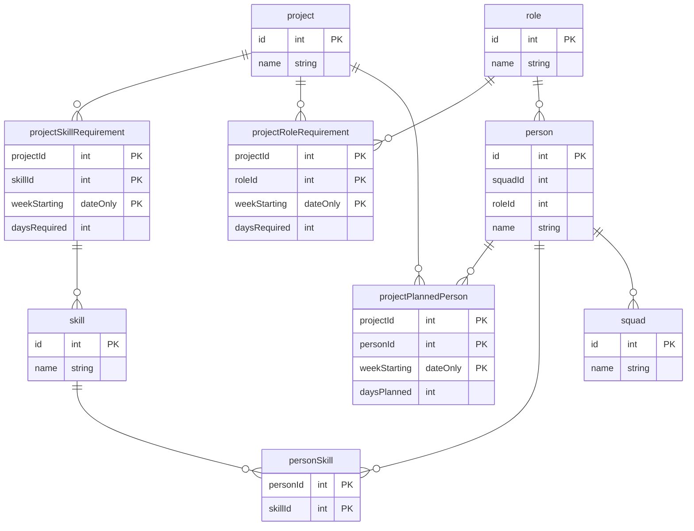

# Buoyancy

## Glossary

### Role
Either:
- Designer
- Tester
- Tech lead
- Full stack developer
- Front end developer
- Back end developer

We can report on:
- Total required days per role per week.
- Total planned days per role per week.
- Required vs planned days per role per week.

### Skill
A skill is a specific technology or tool that a team member has experience with e.g.:
- React
- .Net
- Angular

We can report on:
- Total required days per skill per week.
- Total planned days per skill per week.
- Required vs planned days per skill per week.

### Team member
A person with:
- a single role
- 0 or more skills
- availability

We can report on:
- Total available days per team member per week.
- Total planned days per team member per week.
- Available vs planned days per team member per week.

### Project
A project defines:
- Required roles and skills per week.
- Planned roles and quantities per week.

### Scenario plan
The addition and/or removal of projects on given weeks.

So that we can select a scenario plan and report on:
- Impact on required roles and skills per week.
- Impact on planned roles and skills per week.
- Impact on required vs planned roles and skills per week.

## Features
### Authentication
- [ ] Log in with AD account.

### Person
- [ ] View all people.
- [ ] Add a new person.
- [ ] View capacity vs planned per person per week.
- [ ] View schedule for a person.

### Roles
- [ ] Add a new role.
- [ ] View capacity vs planned per role per week.

### Skills
- [ ] Add a new skill.
- [ ] View capacity vs planned per skill per week.

### Projects
- [ ] View all projects.
- [ ] Add a new project.
- [ ] Manage required roles for a project.
- [ ] Manage required skills for a project.
- [ ] View planned vs required roles for a project.
- [ ] View planned vs required skills for a project.

### Scenario plans
- [ ] View all scenario plans.
- [ ] Create a new scenario plan.
- [ ] Add new project to a scenario plan.
- [ ] Amend an existing project in a scenario plan.
- [ ] View the impact of a scenario plan on required vs planned roles and skills per week.

## Architecture

